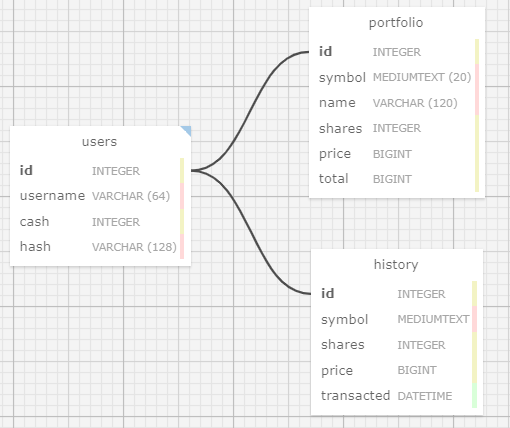

# bits-finance
Course Project: Virtual trading web app which allows users to manage portfolios of stocks, check real stock's actual prices and portfolio values and also let users buy and sell stocks (virtually).

# ER Diagram
   
